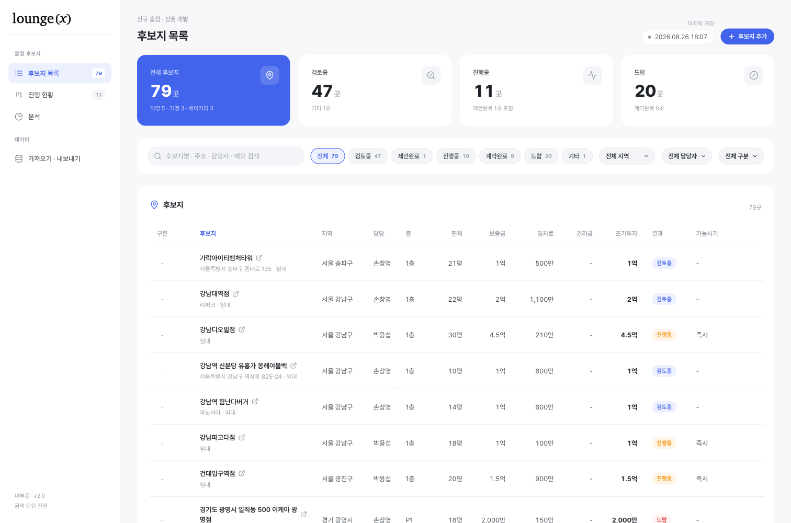

# LOUNGE'X 후보지 관리

라운지엑스 신규 출점 후보지를 등록·추적하는 내부용 대시보드.
[loungex-brand](https://sigmaideas.github.io/loungex-brand/) 와 같은 디자인 시스템(Pretendard · 사이드바 + 카드 레이아웃 · #4263eb 액센트)을 씁니다.

**→ https://sigmaideas.github.io/loungex-candidates/**



## 데이터 기준

구글 시트 **"4. 후보지"** 표의 항목 체계를 그대로 따릅니다.

| 시트 열 | 앱 항목 |
| --- | --- |
| (시트에 없음) | **타입** — Type A · Type B · Type C |
| 경로 | 임대 · 매입 · 라운지 |
| 건물명 · 위치 | 후보지명 · 주소(또는 네이버 지도 링크) |
| 결과 | **상태** — 후보지 · 협의중 · 계약완료 |
| 층수 · 전용 면적 | 층 · 면적(평) |
| 보증금 · 고정 임차료 · 수수료율 · 건물 관리비 · 권리금 | 임대 조건 |
| 계약 가능시기 · 기타 | 진행 |

**금액 단위는 시트와 같은 천원**입니다. 저장은 천원으로 하고, 화면에는 억·만원으로 환산해 보여줍니다
(`73,600` → `7,360만원`). 입력 칸 아래에도 환산값이 바로 뜹니다.

시트에 없는 세 가지는 앱이 자동으로 만듭니다.

- **지역** — 건물명·주소에서 구/시를 뽑아 채웁니다 (`서울 중구`, `경기 광명시` …)
- **초기투자** — 보증금 + 권리금
- **타입** — 모든 후보지는 Type A/B/C 중 하나입니다. 값이 없으면 전용면적으로 정합니다
  (40평 이상 → C, 15평 이상 → B, 나머지 → A). 넣고 나서는 화면에서 직접 바꿉니다
- **좌표** — 지도에 찍으려고 주소를 한 번 지오코딩해 `lat`/`lng` 로 넣어 뒀습니다

`보증금 협의중` `임차료 입찰` 처럼 숫자가 아닌 칸은 값을 0으로 둡니다.

## 구성

프런트는 빌드 없는 정적 파일이라 GitHub Pages 에 그대로 올라갑니다.
데이터는 Cloudflare Worker + KV 에 두고 팀이 공유합니다.

```
index.html            화면 구조
style.css             디자인 시스템 (loungex-brand 토큰 그대로)
app.js                상태 · 렌더 · 저장 · 지도
config.js             공유 저장소(워커) 주소
data/candidates.json  초기 데이터 79곳 (서버가 비었을 때만 씀)
worker/               공유 저장소 Cloudflare Worker + KV
```

외부 의존성은 CDN — Pretendard(폰트), Chart.js(분석 차트), Lucide(아이콘), 카카오맵(지도).

## 화면

| 뷰 | 내용 |
| --- | --- |
| **후보지 목록** | KPI 4종 · 검색 · 상태/지역/타입 필터 · 정렬 표. 행을 누르면 상세, 마우스를 올리면 수정·삭제 |
| **진행 현황** | 상태 3열 칸반. 카드를 끌어 놓으면 상태가 바뀝니다 (더블클릭 = 상세) |
| **후보지 맵** | 좌표를 아는 후보지를 지도에 핀으로. 핀 색은 상태, 글자는 타입. 지도 위 칩으로 타입별로 걸러 볼 수 있고, 목록의 검색·필터도 그대로 적용됩니다 |
| **분석** | 상태 분포 도넛 · 지역별 막대 · 전용면적 대비 월 임차료 산점도 |
| **계약** | 상태가 계약완료인 곳만 모아 계약 조건(보증금·임차료·관리비·권리금·초기투자)과 합계를 봅니다 |

## 데이터 저장

팀 전원이 **같은 목록**을 봅니다. 저장소는 Cloudflare Worker + KV 이고 주소는 `config.js` 에 박혀 있어
쓰는 사람이 따로 설정할 게 없습니다.

읽기는 자동, **쓰기는 수동**입니다.

- 사이트를 열면 서버 목록을 받아옵니다. 이후 20초마다, 그리고 탭을 다시 켤 때 다시 받습니다
- 추가·수정·삭제는 일단 이 브라우저에만 쌓입니다. 상단 배지가 `저장 안 한 변경 있음` 으로 바뀝니다
- **우측 위 [저장하기]** 를 눌러야 팀 전체에 반영됩니다
- 저장 안 한 변경이 있으면 서버에서 받아온 내용으로 덮어쓰지 않습니다. 탭을 닫으려 하면 브라우저가 한 번 물어봅니다
- 두 사람이 같은 후보지를 고치면 `updatedAt` 이 최신인 쪽이 남습니다
- 삭제는 tombstone 으로 60일 기록해서, 오래된 브라우저가 삭제된 항목을 되살리지 않습니다
- 상단 배지 — 초록(저장됨) · 파랑 점멸(불러오는 중·저장 중) · 주황(저장 안 한 변경) · 빨강(연결 실패)

localStorage(`loungex.candidates.v2`)에도 같이 써 두기 때문에, 서버가 잠깐 안 되더라도 화면은 뜹니다.

### 열쇠가 없습니다

저장 API 에 인증을 두지 않았습니다. 워커 주소를 아는 사람은 누구나 데이터를 고치거나 지울 수 있습니다.
사내 도구라 편의를 택한 결정이고, 막아야 할 때가 오면 `worker/README.md` 의 팀 키 항목을 참고하세요.

## 지도

카카오맵 JavaScript SDK 를 씁니다. 앱키는 `index.html` 에 박혀 있는데, 카카오가 **도메인으로**
잠그는 키라 공개 리포에 있어도 다른 사이트에서 못 씁니다.

허용 도메인은 카카오 개발자 콘솔의 **JavaScript SDK 도메인** 에 등록합니다
(앱 ID 1557899). 지금 등록된 값:

```
https://sigmaideas.github.io
http://localhost:8899
```

도메인이 안 맞으면 SDK 가 401 `domain mismatched` 를 주고 지도 자리에 안내 문구가 뜹니다.

핀 위치는 미리 넣어 둔 `lat`/`lng` 로 찍습니다. 78곳 중 **76곳**이 올라갑니다.
좌표가 없는 곳은 지역 중심에 대충 찍지 않고 **아예 뺍니다** — 거기 있는 것처럼 읽히면
잘못된 정보가 되기 때문입니다. 몇 곳이 빠졌는지는 지도 아래에 적힙니다.

### 좌표 다시 뽑기

카카오 로컬 API(REST 키 필요)로 뽑았습니다. 순서대로 시도합니다.

1. 주소 검색 — 도로명·지번 둘 다 받습니다
2. 주소 칸이 사실 건물명일 때를 대비한 키워드 장소검색 (`원그로브`, `두타몰`)
3. 후보지명으로 키워드 장소검색

찾은 결과의 구/시가 등록된 `지역` 과 다르면 버리고 다시 찾습니다. 일반적인 매장명
(`선릉역점`, `충정로점`)이 다른 브랜드 매장에 붙는 걸 막기 위한 검증입니다.

## 단축키

- `⌘/Ctrl + K` — 목록으로 이동 후 검색창 포커스
- `Esc` — 열린 모달 닫기

## 로컬에서 보기

```bash
python3 -m http.server 8899
# http://localhost:8899
```

워커의 CORS 허용 목록에 `localhost:8899` 가 들어 있어서 저장까지 로컬에서 그대로 테스트됩니다.
**로컬에서 누른 [저장하기] 도 실제 팀 데이터에 반영됩니다.**

## 배포

GitHub Pages 로 서비스합니다. `index.html` 의 `style.css?v=N` · `app.js?v=N` 은 캐시 버스팅용이라
파일을 고칠 때 숫자를 함께 올려야 브라우저가 새 파일을 받습니다 (Pages 가 10분 캐시).

워커를 고쳤을 때는 따로 배포해야 합니다.

```bash
cd worker && npx wrangler deploy
```
